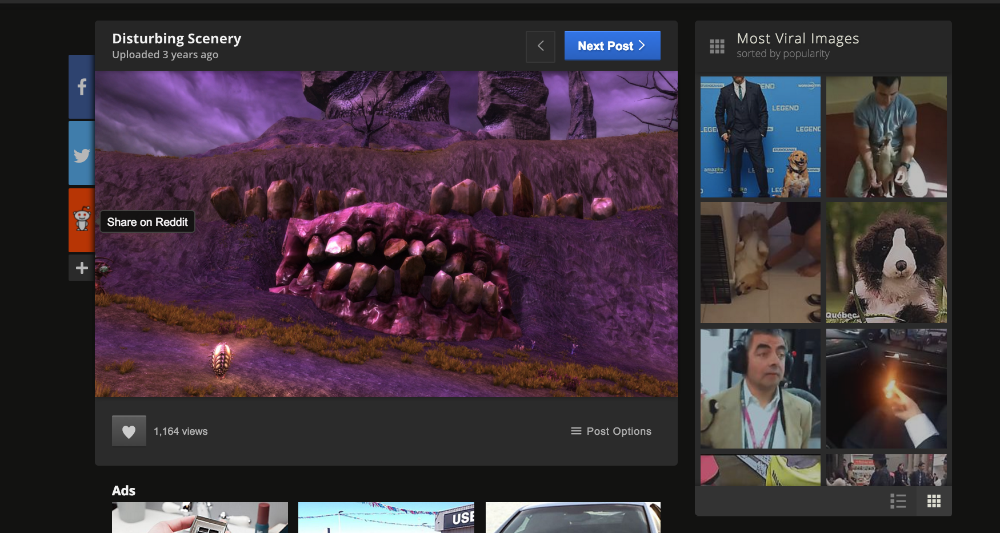
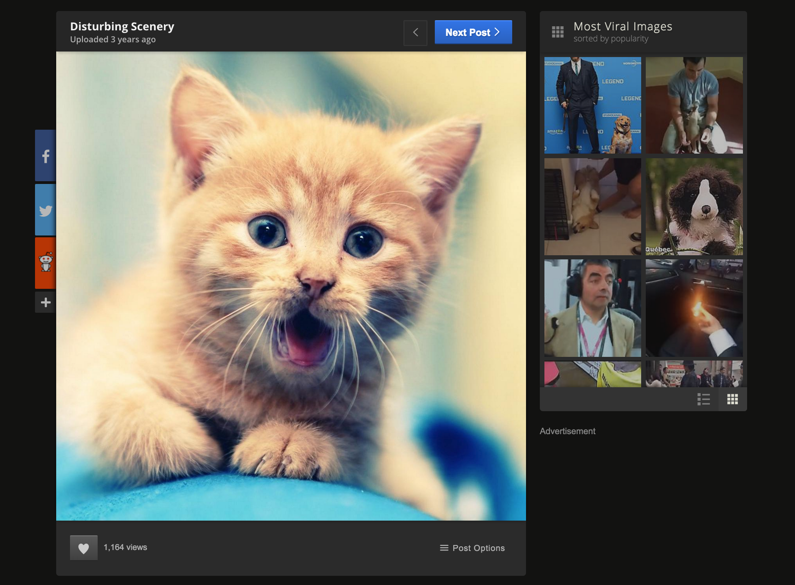

# Nspire2016

##Overview
This chrome extension replaces any depressing or disturbing images with a happy face of a kitten!

##Technology
We used **Clarifi API** to retrieve a list of tags to describe an image, **Pearson Dictionary API** to extract the definition of the tags, and **Indico Sentiment Analysis API** to determine whether an image is positive or negative.

Upon finding any negative images, we replace them with a happy one of kitten!!!

###Before

###After

